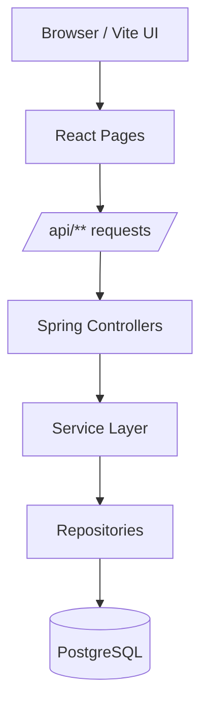
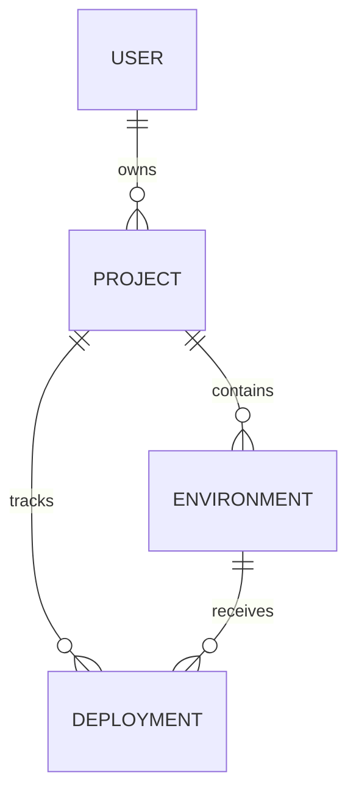

# DevOps Panel

<div align="center">

[](#-tech-stack)
[](#-tech-stack)
[](#-tech-stack)
[](#-tech-stack)
[](#-tech-stack)
[](#-quick-start)
[](#-validation)

**Учебная full-stack панель для управления проектами, окружениями и деплоями.**

Spring Boot API, JWT-аутентификация, PostgreSQL, Liquibase, React, Vite и Docker Compose в одном demo-ready проекте.

[Быстрый старт](#-quick-start) • [Возможности](#-features) • [API](#-api-map) • [Запуск](./LAUNCH.md)

</div>

---

## Contents

- [Overview](#-overview)
- [Features](#-features)
- [Demo Access](#-demo-access)
- [Screens and Flows](#-screens-and-flows)
- [Tech Stack](#-tech-stack)
- [Architecture](#-architecture)
- [Data Model](#-data-model)
- [Security](#-security)
- [Admin Mode](#-admin-mode)
- [API Map](#-api-map)
- [Database and Migrations](#-database-and-migrations)
- [Quick Start](#-quick-start)
- [Manual Check](#-manual-check)
- [Validation](#-validation)
- [Project Structure](#-project-structure)
- [Roadmap](#-roadmap)
- [Notes](#-notes)

## Overview

DevOps Panel моделирует базовый DevOps workflow в понятном UI:

- пользователь входит в систему по JWT;
- создаёт проекты;
- добавляет окружения;
- фиксирует деплои и их описание;
- администратор получает расширенный контроль над проектами.

> [!TIP]
> Проект хорошо подходит для курсовой, демо-защиты, портфолио и показа full-stack архитектуры с реальной авторизацией, миграциями и Docker-запуском.

## Features

| Область | Что уже есть |
| --- | --- |
| Аутентификация | регистрация, вход, JWT |
| Роли | `USER`, `ADMIN` |
| Проекты | создание, просмотр, редактирование, удаление |
| Окружения | создание, список, описание, URL |
| Деплои | создание, список, описание, статус |
| Админский режим | просмотр всех проектов, управление любым проектом |
| UI | русский интерфейс, кликабельные карточки, быстрый фильтр |
| База данных | PostgreSQL + Liquibase |
| Инфраструктура | Docker Compose |
| Тесты | JUnit 5, Mockito, MockMvc |

### UI Highlights

- клик по всей карточке проекта открывает детали;
- админ видит переключатель `Все проекты / Мои проекты`;
- у окружений и деплоев есть описание;
- основные пользовательские сценарии переведены на русский;
- интерфейс подготовлен для ручной демонстрации.

<details>
<summary><b>Почему это уже похоже на реальный учебный продукт</b></summary>

- есть разделение backend/frontend;
- роли влияют на бизнес-логику, а не только на отображение;
- база версионируется через Liquibase;
- локальный запуск возможен как через Docker, так и отдельно;
- проект покрыт тестами и собирается в актуальном состоянии.

</details>

## Demo Access

Seed-админ создаётся автоматически через Liquibase.

| Логин | Пароль | Роль |
| --- | --- | --- |
| `admin` | `password` | `ADMIN` |

> [!IMPORTANT]
> Если вход под `admin / password` не работает, у вас почти наверняка старая база или старый Docker volume. Пересоберите стек и дайте Liquibase применить актуальные миграции.

## Screens and Flows

### User Flow

1. Зарегистрироваться или войти.
2. Открыть список проектов.
3. Создать проект.
4. Перейти в проект кликом по карточке.
5. Добавить окружение.
6. Добавить деплой.
7. Проверить историю деплоев.

### Admin Flow

1. Войти как `admin`.
2. Переключиться между `Все проекты` и `Мои проекты`.
3. Открыть любой проект.
4. Изменить или удалить его, даже если админ не владелец.

## Tech Stack

| Layer | Stack |
| --- | --- |
| Backend | Java 17, Spring Boot, Spring Security, Spring Data JPA, JWT |
| Frontend | React 18, Vite, React Router |
| Database | PostgreSQL |
| Migrations | Liquibase |
| Build | Maven, npm |
| Infra | Docker, Docker Compose |
| Testing | JUnit 5, Mockito, MockMvc, Spring Security Test |

## Architecture

### Backend Layers

| Пакет | Назначение |
| --- | --- |
| `controller` | REST endpoints |
| `service` | бизнес-логика |
| `repository` | доступ к БД |
| `entity` | JPA-сущности |
| `dto` | контракты request/response |
| `security` | JWT и аутентификация |
| `exception` | обработка ошибок |

### Request Flow



### Frontend Notes

- frontend расположен в [`frontend/`](./frontend);
- Vite dev server используется для локальной разработки;
- запросы к backend идут через REST API;
- UI ориентирован на быстрый ручной сценарий проверки.

## Data Model

| Сущность | Роль в системе |
| --- | --- |
| `User` | пользователь с ролью |
| `Project` | основной объект управления |
| `Environment` | окружение проекта |
| `Deployment` | запись о выкладке |

### Relationship Diagram



### Что означают сущности

- `Проект` — приложение или сервис.
- `Окружение` — место выкладки, например `dev`, `staging`, `production`.
- `Деплой` — факт выкладки версии проекта в конкретное окружение.

> [!NOTE]
> В текущей версии деплой — это запись о событии выкладки, а не реальный запуск Kubernetes или CI/CD pipeline.

## Security

### Public Endpoints

- `POST /api/auth/register`
- `POST /api/auth/login`

### Protected Endpoints

- все остальные `/api/**`

### Role Matrix

| Возможность | USER | ADMIN |
| --- | --- | --- |
| Видеть свои проекты | yes | yes |
| Видеть все проекты | no | yes |
| Создавать проекты | yes | yes |
| Изменять свой проект | yes | yes |
| Изменять чужой проект | no | yes |
| Удалять свой проект | yes | yes |
| Удалять чужой проект | no | yes |

### Security Notes

- JWT создаётся в `JwtService`;
- запросы фильтруются через `JwtAuthFilter`;
- пароли кодируются через BCrypt;
- `DaoAuthenticationProvider` использует `UserDetailsServiceImpl`.

## Admin Mode

Администратор получает отдельные практические возможности:

- просмотр всех проектов в системе;
- переключение между всеми проектами и своими;
- редактирование любого проекта;
- удаление любого проекта;
- более заметный `ADMIN` badge в интерфейсе.

<details>
<summary><b>Что можно показать на защите</b></summary>

- вход под обычным пользователем и под админом;
- разное поведение интерфейса для ролей;
- попытку удаления/редактирования проекта;
- историю деплоев внутри проекта;
- наличие миграций и тестов.

</details>

## API Map

### Auth

| Method | Endpoint | Назначение |
| --- | --- | --- |
| `POST` | `/api/auth/register` | регистрация |
| `POST` | `/api/auth/login` | вход и получение JWT |

### Projects

| Method | Endpoint | Назначение |
| --- | --- | --- |
| `GET` | `/api/projects` | все проекты |
| `GET` | `/api/projects/my` | проекты текущего пользователя |
| `GET` | `/api/projects/{id}` | детали проекта |
| `POST` | `/api/projects` | создать проект |
| `PUT` | `/api/projects/{id}` | изменить проект |
| `DELETE` | `/api/projects/{id}` | удалить проект |

### Environments

| Method | Endpoint |
| --- | --- |
| `GET` | `/api/projects/{projectId}/environments` |
| `GET` | `/api/projects/{projectId}/environments/list` |
| `GET` | `/api/projects/{projectId}/environments/{id}` |
| `POST` | `/api/projects/{projectId}/environments` |
| `PUT` | `/api/projects/{projectId}/environments/{id}` |
| `DELETE` | `/api/projects/{projectId}/environments/{id}` |

### Deployments

| Method | Endpoint |
| --- | --- |
| `GET` | `/api/projects/{projectId}/deployments` |
| `GET` | `/api/projects/{projectId}/deployments/{id}` |
| `POST` | `/api/projects/{projectId}/deployments` |
| `PUT` | `/api/projects/{projectId}/deployments/{id}` |
| `DELETE` | `/api/projects/{projectId}/deployments/{id}` |

### Response Codes

`200`, `201`, `204`, `400`, `401`, `403`, `404`, `500`

## Database and Migrations

Liquibase changelog:

- `001-create-users-table.xml`
- `002-create-projects-table.xml`
- `003-create-project-members-table.xml`
- `004-create-environments-table.xml`
- `005-create-deployments-table.xml`
- `006-initial-data.xml`
- `007-add-description-to-environments-and-deployments.xml`

### What Migrations Do

- создают схему;
- поднимают seed admin;
- расширяют модель данных без ручных SQL-правок;
- синхронизируют backend и базу при запуске.

## Quick Start

### Full Stack via Docker

```bash
docker compose up --build -d
```

Проверка:

```bash
docker compose ps
```

Адреса:

- backend: `http://localhost:8080`
- frontend dev: `http://127.0.0.1:5173`

### Frontend Dev Mode

```bash
cd frontend
npm.cmd install
npm.cmd run dev
```

### Backend Only

Нужны:

- Java 17
- Maven
- PostgreSQL

Запуск:

```bash
mvn spring-boot:run
```

Подробный пошаговый гайд: [LAUNCH.md](./LAUNCH.md)

## Manual Check

### Smoke Scenario

1. Открыть `http://127.0.0.1:5173`.
2. Войти как `admin / password`.
3. Проверить переключатель `Все проекты / Мои проекты`.
4. Создать проект.
5. Открыть проект кликом по карточке.
6. Добавить окружение с описанием.
7. Добавить деплой с описанием.
8. Изменить или удалить проект как админ.

### Checklist

- [ ] фронтенд открывается
- [ ] логин под админом работает
- [ ] список проектов загружается
- [ ] карточка проекта открывается по клику
- [ ] окружение создаётся
- [ ] описание окружения сохраняется
- [ ] деплой создаётся
- [ ] описание деплоя сохраняется
- [ ] админ может удалить чужой проект

## Validation

### Backend

```bash
mvn test
```

### Frontend

```bash
cd frontend
npm.cmd run build
```

### What Is Covered

- сервисная логика;
- controller tests;
- проверка frontend production build.

## Project Structure

```text
fullfinal-main/
|-- src/
|   |-- main/
|   |   |-- java/com/devops/panel/
|   |   |   |-- config/
|   |   |   |-- controller/
|   |   |   |-- dto/
|   |   |   |-- entity/
|   |   |   |-- exception/
|   |   |   |-- repository/
|   |   |   |-- security/
|   |   |   `-- service/
|   |   `-- resources/db/changelog/
|   `-- test/
|-- frontend/
|-- postman/
|-- Dockerfile
|-- docker-compose.yml
|-- README.md
|-- LAUNCH.md
`-- pom.xml
```

## Roadmap

- отдельная страница управления пользователями для админа;
- управление статусами деплоев из UI;
- аудит админских действий;
- интеграция с GitHub/GitLab;
- симуляция pipeline trigger;
- health/status dashboard для окружений.

## Notes

- Проект рассчитан на локальную демонстрацию и учебное использование.
- README синхронизирован с текущим состоянием кода и актуальными credential'ами.
- Если нужно больше “production-like” DevOps-функций, следующим шагом стоит добавлять логи, webhooks и pipeline execution.
